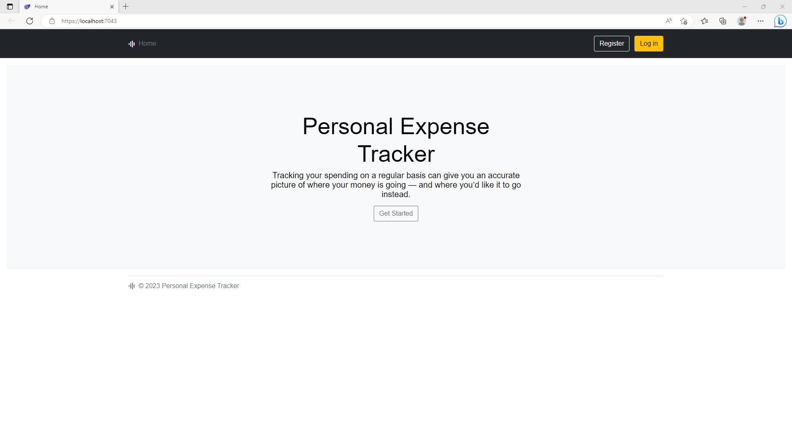
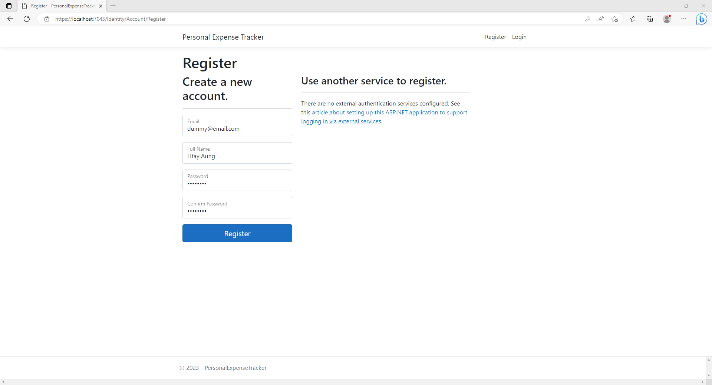
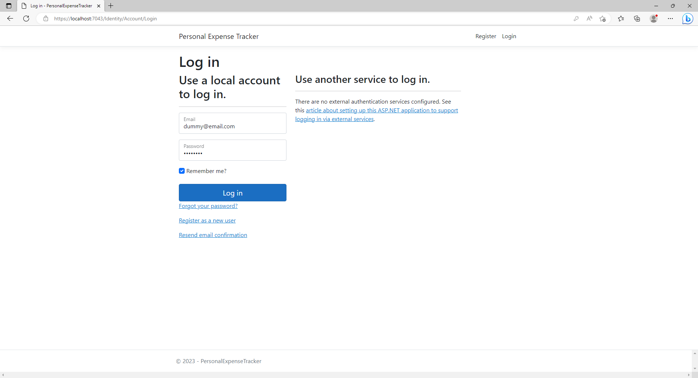
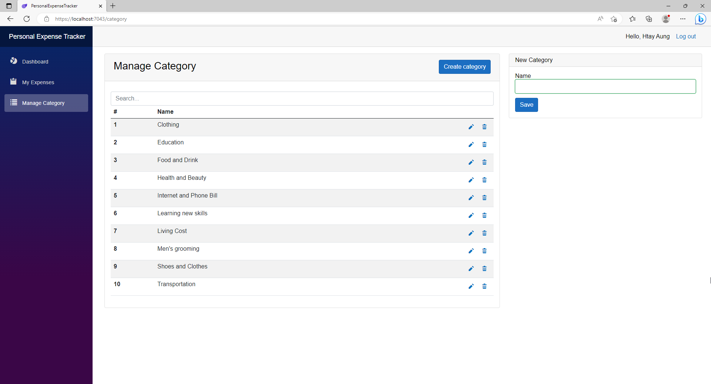
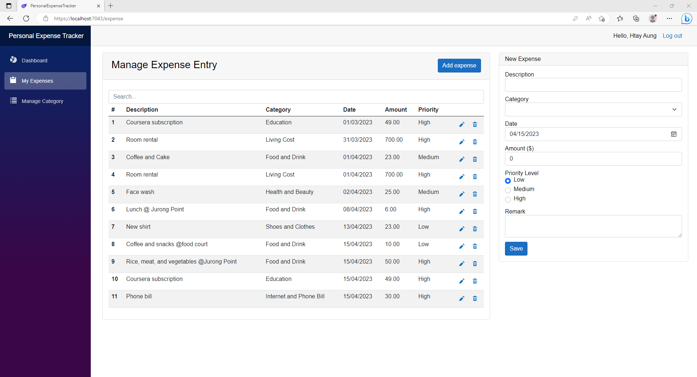
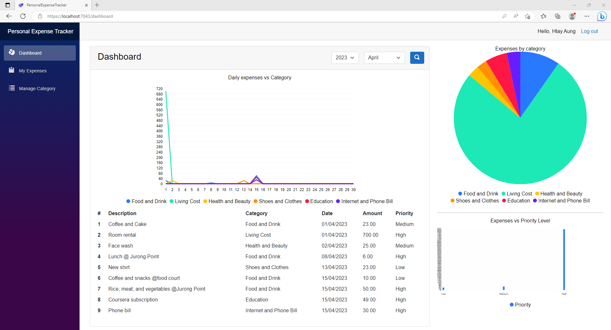

# Personal Expense Tracker

## Background
Tracking your spending on a regular basis can give you an accurate picture of where your money is going — and where you’d like it to go instead.

This is a demo project using the following technologies.

If you want to learn more about Blazor, visit official website at https://dotnet.microsoft.com/en-us/apps/aspnet/web-apps/blazor.

## Technologies used
* C#
* .NET 7
* Blazor Server
* Entity Framework Core
* SQL Express
* Bootstrap
* [MudBlazor](https://mudblazor.com) (for chart components)

## Screenshots

  
  
  
  
  
    

